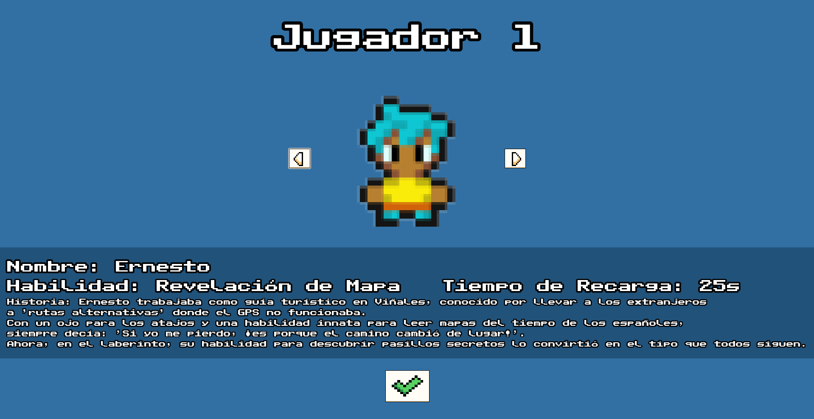
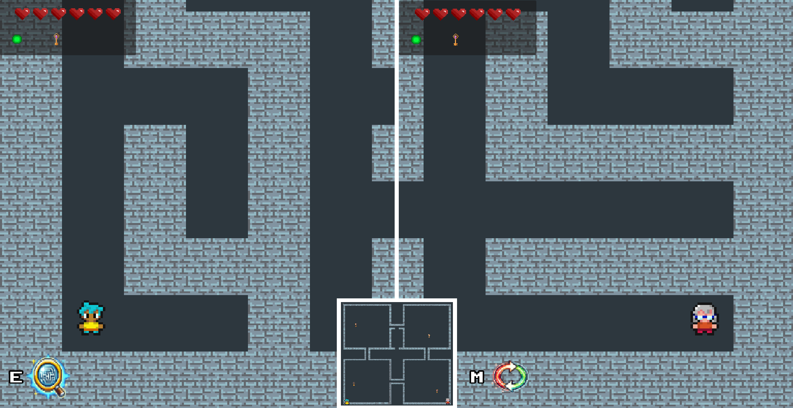

# 🌀 Maze Runners 🏃‍♂️🏃‍♀️

🎮 *¡Un desafío de velocidad, estrategia y supervivencia en un laberinto lleno de trampas!*  

## 📜 Historia del Juego
Dos jugadores han sido atrapados en un laberinto lleno de peligros y solo uno podrá salir victorioso. Para ganar, deberán esquivar trampas, usar habilidades únicas y recolectar llaves que abren la puerta de la victoria. 

## 🕹️ Controles
- **Jugador 1**:
  - Movimiento: `W A S D`
  - Habilidad especial: `E`
  - Ataque: `R`

- **Jugador 2**:
  - Movimiento: `↑ ↓ ← →`
  - Habilidad especial: `M`
  - Ataque: `N`

## ⚔️ Habilidades Especiales
Cada personaje tiene una habilidad única que puede ser activada estratégicamente:

| Personaje  | Habilidad | Descripción | Enfriamiento |
|------------|-----------|-------------|-------------|
| 🏥 **Miguel** | Curación | Recupera 2 puntos de vida. | 25s |
| 🏃 **Yadira** | Sprint | Aumenta su velocidad x3 durante 5 segundos. | 35s |
| 🛡️ **Maritza** | Escudo | Ignora trampas y ataques por 20 segundos. | 40s |
| 🗺️ **Ernesto** | Revelación de mapa | Amplía el rango de visión por 10 segundos. | 25s |
| 🔄 **Manolo** | Intercambio de posición | Cambia de lugar con el otro jugador. | 45s |

## 🚀 Objetivo del Juego
🔑 Recolecta **3 llaves** para abrir la puerta de salida.  
⚠️ Evita trampas como fuego, púas y osos.  
⚔️ Usa tu **experiencia** y habilidad para derrotar a tu oponente.  
🎯 ¡Llega a la *Zona de Victoria* antes que tu rival y gana la partida!

## 🏗️ Tecnologías Utilizadas
- **Godot 4.3** (Motor de desarrollo)
- **C#** (Lenguaje de programación)
- **Pixel Art** (Estilo gráfico)

## 📸 Capturas del Juego 

## 💡 Notas Finales
Maze Runners es un juego de estrategia y habilidad que pondrá a prueba tu rapidez mental y reflejos. ¡Elige tu personaje sabiamente, usa tu habilidad en el momento adecuado y escapa del laberinto antes que tu rival!  

📢 *¿Listo para el desafío?* 🔥
